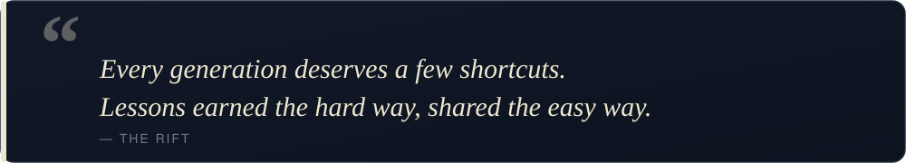

  

  

---

I build ventures, ship products, and help dev shops turn raw skill into real businesses. Most of what I learn ends up written down, so the next person can take the shortcut.

### What's on my plate these days

  
  
  
  

- **[Biz of Dev](https://bizofdev.com/)** — consulting for dev shops that want to grow up into businesses.
- **[The Wandering Pro](https://thewanderingpro.com/)** — community for people building a life around their work, not the other way around.
- **[SK NEXUS](https://www.sknexus.org/)** — content, ideas, and the occasional strong opinion.
- **[The Rift](https://saqibtahir.com/the-rift)** — my running journal.

### Some things I'm known for

- **Figure out the right thing, then build it right.**
- **Learning by execution: doing, breaking, figuring out why it broke.**
- **A framework is just a fundamental with a cover on it.**
- **An idea is usually three ideas in a trench coat.**
- **Obsessive about understanding things before I claim to know them.**

 

  

### Find me

  
  

<!---
saqibtahirpk/saqibtahirpk is a ✨ special ✨ repository because its `README.md` (this file) appears on your GitHub profile.
You can click the Preview link to take a look at your changes.
--->
