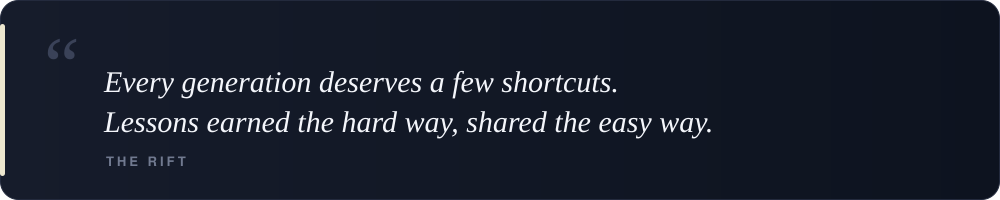

  

  

I run a product company, work 1:1 with a few founders as their Operating Partner, and build a publication and a community that teach tech and career the way I learned it. Most of what I learn ends up written down, so the next person can take the shortcut.

### What's on My Plate

  

  
  

  
  

### Some Things I'm Known For

- **Figure out the right thing, then build it right.**
- **Learning by execution: doing, breaking, figuring out why it broke.**
- **A framework is just a fundamental with a cover on it.**
- **An idea is usually three ideas in a trench coat.**
- **Obsessive about understanding things before I claim to know them.**

 

  

### Find Me

  
  
  
  

